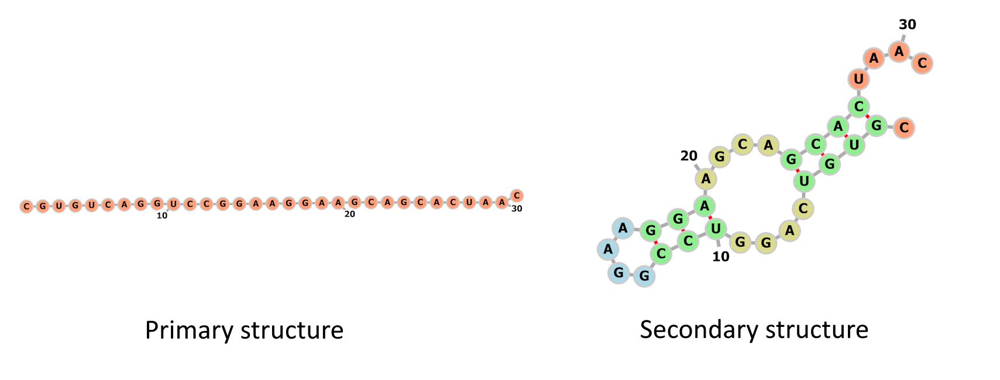

.. diurnal documentation master file, created by
   sphinx-quickstart on Mon Apr 24 21:50:08 2023.

.. Generate the source code documentation file with `sphinx-apidoc -o ./source ../diurnal`

diurnal
=======

``diurnal`` is a Python library that facilitates RNA secondary structure
predictions.

This library aims at streamlining the process of elaborating, training, and
validating RNA structure predictive models. Researchers can use it under the MIT
license to develop and publish models that can be easily replicated by other
users.

This page presents an :ref:`overview` of the project and its
:ref:`usage`. The :ref:`user-guide` provides detailed explanations of
the library. The :ref:`source-code-documentation` presents the signature
of all the components of the library. The :ref:`lit_review` provides the list of
references that were used to develop the project and discusses other similar
projects. The :ref:`developer-guide` explains how the project is organized and
how to contribute to it.

.. toctree::
    :glob:
    :maxdepth: 1

    user_guide
    source/modules
    developer_guide
    literature_review

.. _overview:

Overview
--------

This library contains **RNA secondary structure predictive models**. It also
comprises utility components that automate data processing tasks.

In short, RNA secondary structure describes the *pairings* of nucleotides. RNA
(ribonucleic acid) is a molecule that performs a variety of biological
functions. It is therefore the subject of interest for molecular biologists who
aim at determining their function. An RNA molecules is made of a chain of
*nucleotides* that can fold onto itself. One can describe the structure of RNA
molecules in different ways.

- The sequence of nucleotides is the *primary structure*. In general, RNA uses
  four possible nucleotides: adenine, cytosine, guanine, and uracil. They are
  represented by the letters ``A``, ``C``, ``G``, and ``U``, respectively.
- The way that nucleotides combine with one another is the *secondary
  structure*. One way to represent the secondary structure is to use the
  **dot-bracket notation**. Unpaired nucleotides are represented by a dot
  (``.``). A nucleotide paired with a nucleotide closer to the 3' end of the
  molecule (i.e. to the right) is represented by an opening parenthesis
  ( ``(`` ). A nucleotide paired with a nucleotide closer to the 5' end of the
  molecule (i.e. to the left) is represented by a closing parenthesis ( ``)`` ).
- The 3D arrangement of the molecule is the *tertiary structure*. The tertiary
  structure is not studied in this project but can be used to better understand
  the function of the molecule.

The image below displays the primary and secondary structures of a short RNA
molecule.

       part of the image displays a straight chain of 31 nucleotides. This is
       the primary structure. The right part of the image shows a 2D
       representation of paired nucleotides that form stems and loops. This is
       the secondary structure.

   Primary and secondary structures of a short RNA molecule. Nucleotide sequence
   taken from :cite:`cnnfold` and images generated with the ``forna``
   :cite:`forna` visualization tool.

In the example above:

- The **primary structure** can be represented as
  ``CGUGUCAGGUCCGGAAGGAAGCAGCACUAAC``.
- The **secondary structure** can be represented as
  ``.((((....(((....)))....))))....``.

Since determining the function of an RNA molecule from its primary structure is
difficult, researchers rely on its secondary structure. Unfortunately,
determining secondary structures experimentally is costly and time-consuming.
There is hence an interest in reliably determining secondary structures from
primary structures to understand the function of RNA molecules more effectively.

The ``diurnal`` library **predicts secondary structures from primary
structures**. It can:

- download RNA structure datasets,
- encode the datasets into trainable representations,
- prepare the data for different evaluation methods,
- train and evaluate models, and
- visualize results.

``diurnal`` is released under the MIT license and developed in Python. It relies
on the ``Numpy`` and ``PyTorch`` libraries for data manipulation and neural
network utilization.

.. _usage:

Basic Usage
-----------

Consult the reference notebook at https://github.com/Vincent-Therrien/diurnal/blob/main/demo/example.ipynb
for a complete use case of the library.

Indices and tables
==================

* :ref:`genindex`
* :ref:`modindex`
* :ref:`search`
