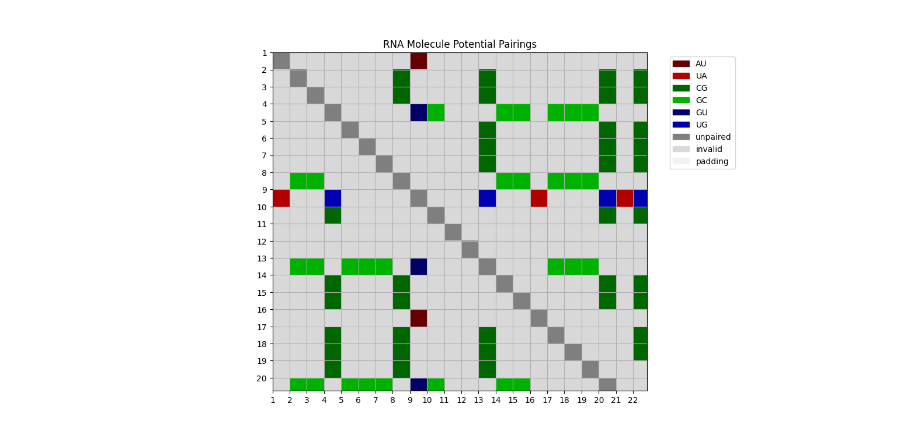

.. _lit_review:

Literature Review
=================

.. bibliography:: references.bib
   :filter: False

This page presents research efforts conducted in the field of RNA structure
prediction.

View the section :ref:`overview` for background information about RNA molecules.

Problem Statement
-----------------

The objective of RNA secondary structure prediction is to determine the pairing
of nucleotide from their sequence. This can be described as a
**prediction problem** in which:

- The **input** is a sequence of four characters: ``A``, ``C``, ``G``, and
  ``U`` (i.e. primary structure).
- The **output** is s sequence of characters describing the pairing of
  nucleotides (i.e. secondary structure). This structure can be described in
  different ways:
  - The **bracket notation** uses the characters ``.``, ``(``, and ``)`` to
    designate nucleotides that are unpaired, paired with a nucleotide in the
    3' direction, or paired with a nucleotide in the 5' direction, respectively.
    It cannot represent pseudo-knots.
  - The **shadow** of the secondary structure is a sequence of Boolean values
    to distinguish paired and unpaired nucleotides (e.g. ``0`` and ``1``). The
    shadow describes the secondary structure in less detail than the bracket
    notation.
  - The **list of pairing indices** is a sequence of integers that each indicate
    to which nucleotide a nucleotide in the sequence is paired. For instance, in
    the zero-based list ``[2, -1, 0]``, the first nucleotide is paired to the
    third nucleotide. The value ``-1`` designates an unpaired nucleotide. CT
    files use one-based lists of pairing indices. It can represent pseudo-knots.
  - The **scoring matrix** presents a list of pairing indices in a 2D matrix.
    It can represent pseudo-knots.

Alternatively, this problem can be described as "multiple binary classification
problems that predict whether each pair of nucleotides forms a base pair or not"
:cite:`mxfold2`.

RNA secondary structure prediction methods usually comprise the following
stages:

- **Pre-processing** transforms the primary structure (i.e. sequence of letters)
  into another representation.
- **Prediction** converts the input into an output using a previously
  trained model.
- **Post-processing** transforms the output of the model into a secondary
  structure (e.g. bracket notation or shadow).

Definitions
-----------

+---------------------+-------------------------------------------------------+
| Term                | Definition                                            |
+=====================+=======================================================+
| contact matrix      | A 2D matrix in which 0 indicates a non-paired base    |
| or pairing scoring  | and 1 indicates a paired base. Can represent a        |
| matrix              | secondary structure with pseudo-knots :cite:`cnnfold` |
|                     | :cite:`ufold`.                                        |
+---------------------+-------------------------------------------------------+

Classical Prediction Models
---------------------------

The term "classical model" is used in this context to refer to predictive models
that do not rely on neural network.

- MXFold2
- RNAfold
- RNAstructure
- TORNADO

Prediction Models Based on Neural Networks
------------------------------------------

This section summarizes a few recent RNA secondary structure prediction models.

REDfold (2023)
''''''''''''''

REDfold :cite:`redfold` uses a contact matrix as the input and an
encoder-decoder for the processing. It supports pseudoknots.

CNNFold (2022)
''''''''''''''

CNNFold :cite:`cnnfold` is a predictive model designed by Booy, Ilin, and
Orponen that *uses no energy model and can predict pseudo-knots*.

The **input** of the model is a **matrix of possible pairings**. Each cell
indicates if the pairing is possible and, if so, what bases would be paired to
one another, as shown in the figure below:

   Example of a matrix of potential pairings.

This representation makes the predictive model more efficient because it
captures global information about the structure of the molecule. Instead of
only using the local information of a primary structure (i.e. a nucleotide and
its neighboring nucleotides), the model can rely on the pre-processed potential
pairings.

The **predictive model** is a **deep convolutional neural network**. It uses
only the pairing matrix as the input and does not consider any energy model.

The **output** is a **scoring matrix** that is converted to a secondary
structure.

ATTFold (2020)
''''''''''''''

ATTFold :cite:`attfold` is a predictive model designed by Wang, Liu, Gao, Zhang,
and Dong that *uses no energy model and can predict pseudo-knots*.

The **input** is a one-hot encoded primary structure.

The **model** is a pipeline of components:

- The first component is a transformer network that encodes the primary
  structure.
- A CNN follows the transformer and decodes the output of the transformer into
  a base pairing scoring matrix.
- **Hard constraints** are then applied to the scoring matrix to (1) remove
  impossible pairings (e.g. ``A`` to ``C``) and (2) remove pairings less than
  three bases apart.

The **output** is a base pairing scoring matrix.

UFold (2022)
''''''''''''

UFold :cite:`ufold` is a predictive model designed by Fu, Cao, Wu, Peng, Nie,
and Xie that *uses no energy model and can predict pseudo-knots*.

The **input** is a contact matrix, which is generated by computing the Kronecker
product of the one-hot encoded primary structure with itself. This data
structure differs from the matrix of possible pairings used in CNNFold.

The **model** is a U-Net neural network.

The **output** is a base pairing scoring matrix.

MXFold2 (2021)
''''''''''''''

MXFold2 :cite:`mxfold2` is a predictive model designed by Sato, Akiyama, and
Sakakibara that *uses an energy model and cannot predict pseudo-knots*.

The **input** is the one-hot encoded primary structure.

The **model** is a pipeline of components:

- A BiLSTM recurrent neural network.
- Convolutional and concatenation layers.
- A Zucker-style dynamic programming algorithm (THAT's the energy model, right
  there).

The **output** is the secondary structure in dot-bracket notation.

CDPFold (2019)
''''''''''''''

CDPFold :cite:`cdpfold` is a predictive model designed by Zhang, Li, and Wei
that *uses no energy model and cannot predict pseudo-knots*.

The **input** of the model is a matrix-encoded encoded primary structure whose
element represent possible base pairings. This is similar to CNNFold, but the
elements of the matrix are scalars instead of vectors.

The **model** is a pipeline of components:

- A CNN predicts base pairing probabilities.
- A maximum probability sum algorithm (a modified Nussimov dynamic programming
  method) corrects predictions to obtain valid secondary structures.

The **output** is the secondary structure in dot-bracket notation.

SPOT-RNA (2019)
'''''''''''''''

SPOT-RNA :cite:`spotrna` is a predictive model designed by Singh, Hanson,
Paliwal, and Zhou that *uses no energy model and can predict pseudo-knots*.

The model uses ensemble and transfer learning to predict structures.

General Observations
''''''''''''''''''''

Szikszai et al. :cite:`szikszai22` show that most models based on neural
networks perform poorly at family-wise cross validation. In other words, they
have a hard time generalizing predictions to unfamiliar structures.

Datasets
--------

:cite:`rnastrand`

- RNAStralign: https://www.urmc.rochester.edu/rna/
- RNAalign: https://drive.google.com/drive/folders/19KPRYJjjMJh1qdMhtmUoYA_ncw3ocAHc
- RFam: https://rfam.org/

References
----------

.. bibliography:: references.bib
