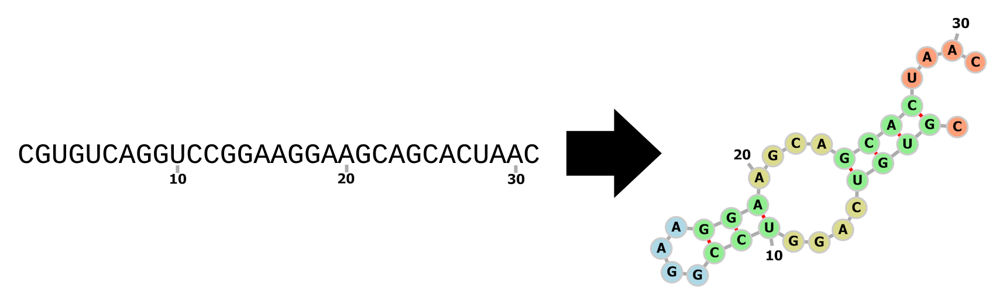

diurnal
=======

- `English (en) <#Predict-RNA-Secondary-Structures>`_
- `Français (fr) <#Prédire-les-structures-secondaires-de-lARN>`_



Predict RNA Secondary Structures
--------------------------------

``diurnal`` is a Python library that can predict RNA secondary structures and
help develop new prediction models.

Features:

- Download RNA datasets (ArchiveII, RNASTRalign, and RNA_STRAND)
- Pre-process data for training
- Train neural network
- Evaluate performances
- Visualize results


Installation
````````````

This library requires Pytorch, which can be installed as described on the page
https://pytorch.org/get-started/locally/. After Pytorch is installed in your
environment, you can install the ``diurnal`` library with ``pip``:

.. code-block:: bash

   pip install .


Demonstrations
``````````````

The following
`notebook <https://github.com/Vincent-Therrien/diurnal/blob/main/demo/example.ipynb>`_
presents a full use case of the library. You can find more examples in the
``demo`` directory.


Documentation
`````````````

The documentation is available `here <https://vincent-therrien.github.io/>`_.
You can access the documentation source code in the directory ``docs``.


Test Suite
``````````

The test suite can be executed with the command:

.. code-block:: bash

   pytest test


.. _Français - fr:

Prédire les structures secondaires de l'ARN
-------------------------------------------

``diurnal`` est une bibliothèque Python qui sert à prédire les structures
secondaires de molécules d'ARN et à développer de nouveaux modèles.

Fonctionnalités :

- Télécharger des ensembles de données (ArchiveII, RNASTRalign, et RNA_STRAND)
- Pré-traiter les données en vue de l'entraînement
- Concevoir et entraîner des réseaux neuronaux
- Évaluer les performances
- Visualiser les résultats


Installation
````````````

La bibliothèque requiert Pytorch, qui peut être installé en suivant les
instructions disponibles à https://pytorch.org/get-started/locally/. Une fois
Pytorch installé, vous pouvez installer ``diurnal`` avec les commandes
suivantes :

.. code-block:: bash

   cd diurnal
   pip install .


Scripts de démonstration
````````````````````````

Le `carnet interactif <https://github.com/Vincent-Therrien/diurnal/blob/main/demo/example.ipynb>`_
inclus dans le répertoire des démonstrations présente un cas d'utilisation
complet de la bibliothèque. Consultez le répertoire ``./demo`` pour voir des
exemples commentés d'utilisation de la bibliothèque.


Documentation
``````````````

La documentation est disponible `ici <https://vincent-therrien.github.io/>`_.


Cadre de tests
``````````````

Le dépôt contient un cadre de tests automatisés développé avec la bibliothèque
``pytest``. Lancez la commandes suivante pour l'exécuter :

.. code-block:: bash

   pytest test
